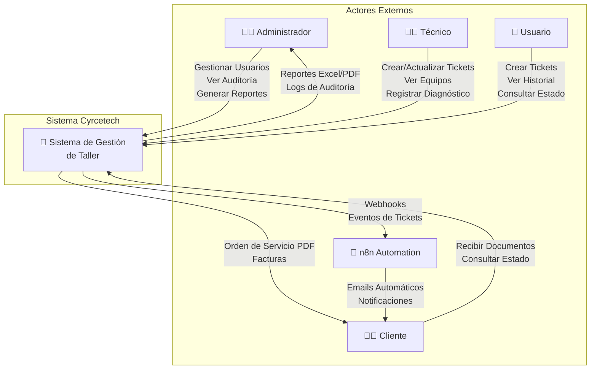
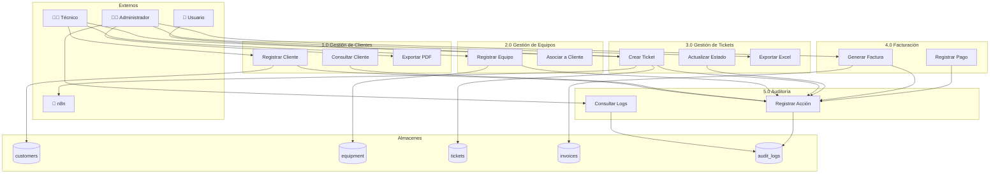
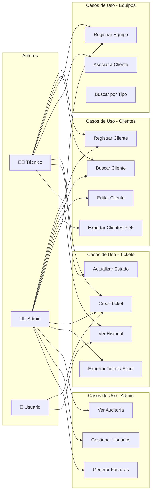
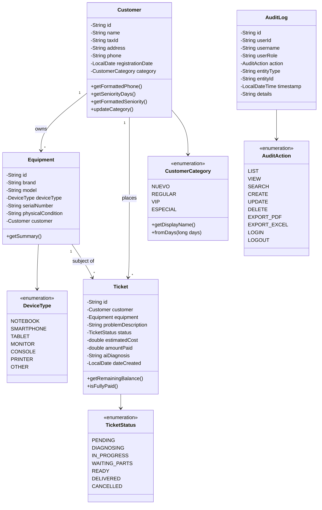
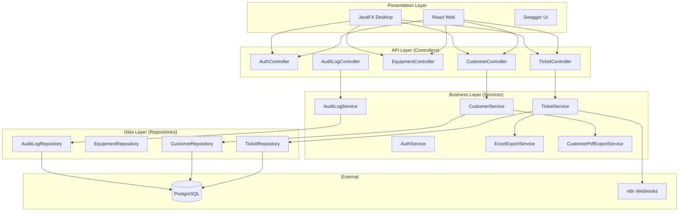
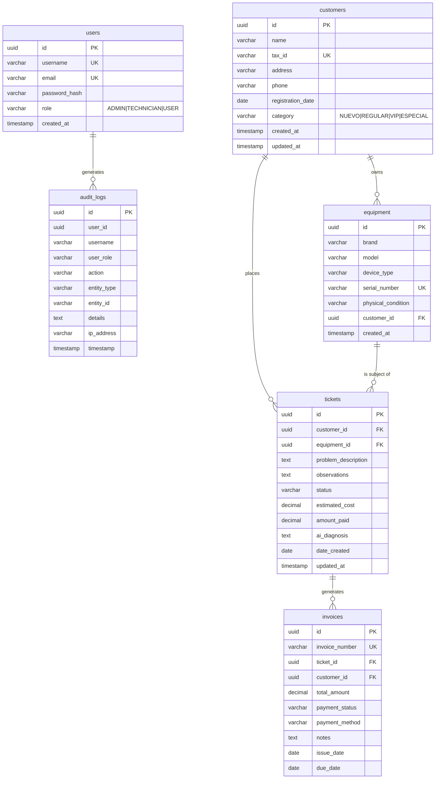

# Manual del Proyecto Cyrcetech v2.3.0

## 1. Introducción

Cyrcetech es un sistema integral de **Gestión de Taller de Reparación (SaaS / On-Premise)** diseñado para administrar órdenes de servicio, clientes, inventario y facturación. El sistema utiliza una arquitectura híbrida con un Backend centralizado (Spring Boot) y clientes Frontend (JavaFX Desktop y React Web).

### Tecnologías Clave
- **Backend**: Java 25, Spring Boot 3.4.0, Spring Security (JWT)
- **Frontend Desktop**: JavaFX 21, Modular, Estilos CSS modernos
- **Frontend Web**: React 19 (Vite)
- **Base de Datos**: PostgreSQL 18
- **Integraciones**: CyrcePDF (PDF), Apache POI (Excel), n8n (Automatización), Docker

---

## 2. Diagrama de Contexto

Representa al sistema como una caja negra mostrando las interacciones con actores externos.



### Entradas del Sistema
| Entrada | Actor | Descripción |
|---------|-------|-------------|
| Datos de Cliente | Técnico/Admin | Nombre, teléfono, dirección, RUC/DNI |
| Datos de Equipo | Técnico | Marca, modelo, tipo, condición física |
| Orden de Servicio | Técnico/Usuario | Descripción del problema, costo estimado |
| Diagnóstico AI | Sistema | Análisis automático del problema |
| Pagos | Admin | Registro de pagos parciales/totales |

### Salidas del Sistema
| Salida | Destino | Formato |
|--------|---------|---------|
| Orden de Servicio | Cliente | PDF |
| Factura | Cliente | PDF |
| Reporte de Tickets | Admin | Excel (.xlsx) |
| Reporte de Clientes | Admin | PDF (con antigüedad) |
| Logs de Auditoría | Admin | JSON/Tabla |
| Webhooks | n8n | HTTP POST JSON |

---

## 3. Diagrama de Flujo de Datos (DFD Nivel 1)



---

## 4. Diagrama de Casos de Uso



### Descripción de Casos de Uso Principales

| ID | Caso de Uso | Actor Principal | Descripción |
|----|-------------|-----------------|-------------|
| UC1 | Registrar Cliente | Técnico/Admin | Crear nuevo cliente con datos de contacto |
| UC4 | Exportar Clientes PDF | Admin | Generar PDF con lista de clientes y antigüedad |
| UC8 | Crear Ticket | Técnico/Usuario | Registrar nueva orden de servicio |
| UC9 | Actualizar Estado | Técnico | Cambiar estado (PENDING → DIAGNOSING → READY) |
| UC11 | Exportar Tickets Excel | Admin | Descargar todos los tickets en formato Excel |
| UC12 | Ver Auditoría | Admin | Consultar logs de acciones del sistema |

### Matriz de Permisos por Rol

| Acción | Usuario | Técnico | Admin |
|--------|:-------:|:-------:|:-----:|
| Ver sus propios datos | ✅ | ✅ | ✅ |
| Editar su perfil | ✅ | ✅ | ✅ |
| Crear tickets | ✅ | ✅ | ✅ |
| Ver todos los tickets | ❌ | ✅ | ✅ |
| Tomar/gestionar tickets | ❌ | ✅ | ✅ |
| Crear usuarios | ❌ | ❌ | ✅ |
| Cambiar roles | ❌ | ❌ | ✅ |
| Ver reportes completos | ❌ | ❌ | ✅ |
| Configurar el sistema | ❌ | ❌ | ✅ |
| Ver auditoría | ❌ | ❌ | ✅ |
| Exportar Excel/PDF | ❌ | ✅ | ✅ |

---

## 5. Diagrama de Clases (Dominio)



---

## 6. Diseño del Sistema

### 6.1 Arquitectura

El sistema implementa **Clean Architecture** con separación en capas:



### 6.2 Diseño de Base de Datos (ERD)



### 6.3 APIs / Módulos Internos

| Módulo | Función | Entradas | Salidas | Dependencias |
|--------|---------|----------|---------|--------------|
| **AuthService** | Autenticación JWT | email, password | JWT Token, UserInfo | UserRepository, JwtService |
| **CustomerService** | CRUD Clientes | CustomerRequest | CustomerResponse | CustomerRepository, PdfExportService |
| **TicketService** | Gestión Tickets | TicketRequest | TicketResponse | TicketRepo, WebhookService, ExcelExportService |
| **AuditLogService** | Registro de acciones | action, entity | void | AuditLogRepository, SecurityContext |
| **ExcelExportService** | Exportar a Excel | List&lt;Ticket&gt; | byte[] (xlsx) | Apache POI |
| **CustomerPdfExportService** | Exportar a PDF | List&lt;Customer&gt; | byte[] (pdf) | CyrcePDF |
| **WebhookService** | Notificar eventos | TicketResponse | HTTP Response | HttpClient |

---

## 7. Implementación

### 7.1 Lenguaje y Librerías

| Componente | Tecnología | Versión |
|------------|------------|---------|
| **Lenguaje** | Java | 25 |
| **Framework Backend** | Spring Boot | 3.4.0 |
| **ORM** | Spring Data JPA / Hibernate | 6.x |
| **Seguridad** | Spring Security + JWT | 6.x |
| **PDF** | CyrcePDF | 1.0.0 |
| **Excel** | Apache POI | 5.2.5 |
| **Base de Datos** | PostgreSQL | 18.1 |
| **Frontend Desktop** | JavaFX | 21 |
| **Frontend Web** | React + Vite | 19 |
| **Automatización** | n8n | Docker |

### 7.2 Requisitos del Sistema

| Requisito | Mínimo | Recomendado |
|-----------|--------|-------------|
| **JDK** | 21 | 25 |
| **RAM** | 4 GB | 8 GB |
| **Disco** | 500 MB | 2 GB |
| **Docker** | 20.x | 24.x |
| **PostgreSQL** | 14 | 18 |

### 7.3 Estructura del Proyecto

```
cyrcetech/
├── backend/                          # Spring Boot Backend
│   ├── src/main/java/com/cyrcetech/backend/
│   │   ├── config/                   # Configuraciones (Security, CORS, OpenAPI)
│   │   ├── controller/               # REST Controllers
│   │   ├── domain/entity/            # Entidades JPA + Enums
│   │   ├── dto/                      # Request/Response DTOs
│   │   ├── exception/                # Manejo de excepciones
│   │   ├── repository/               # Spring Data Repositories
│   │   ├── security/                 # JWT, UserDetails
│   │   └── service/                  # Lógica de negocio
│   └── build.gradle
│
├── src/main/java/com/cyrcetech/      # JavaFX Frontend
│   ├── app/                          # Aplicación principal
│   ├── entity/                       # Modelos locales
│   ├── infrastructure/api/           # Clientes REST
│   └── interface_adapter/controller/ # Controllers FXML
│
├── frontend-web/                     # React Frontend
│   ├── src/
│   │   ├── components/
│   │   ├── pages/
│   │   └── services/
│   └── package.json
│
├── docker-compose.yml                # PostgreSQL + n8n
└── README.md
```

### 7.4 Fragmentos de Código Relevantes

#### Categorización Automática de Clientes
```java
// CustomerCategory.java
public static CustomerCategory fromDays(long daysSinceRegistration) {
    if (daysSinceRegistration <= 30) return NUEVO;
    if (daysSinceRegistration <= 180) return REGULAR;
    if (daysSinceRegistration <= 365) return VIP;
    return ESPECIAL;
}
```

#### Registro de Auditoría
```java
// AuditLogService.java
public void logAction(AuditAction action, String entityType, String entityId, String details) {
    Authentication auth = SecurityContextHolder.getContext().getAuthentication();
    AuditLog log = new AuditLog();
    log.setUserId(getUserId(auth));
    log.setUsername(auth.getName());
    log.setAction(action);
    log.setEntityType(entityType);
    log.setTimestamp(LocalDateTime.now());
    auditLogRepository.save(log);
}
```

#### Exportación a Excel
```java
// ExcelExportService.java
public byte[] exportTicketsToExcel(List<Ticket> tickets) throws IOException {
    try (Workbook workbook = new XSSFWorkbook()) {
        Sheet sheet = workbook.createSheet("Tickets");
        // Headers + Data rows
        ByteArrayOutputStream out = new ByteArrayOutputStream();
        workbook.write(out);
        return out.toByteArray();
    }
}
```

---

## 8. Nuevas Funcionalidades v2.3.0

### Categoría de Clientes
| Categoría | Rango | Descripción |
|-----------|-------|-------------|
| NUEVO | 0-30 días | Cliente reciente |
| REGULAR | 1-6 meses | Cliente establecido |
| VIP | 6-12 meses | Cliente fiel |
| ESPECIAL | 1+ año | Cliente preferencial |

### Sistema de Auditoría
- Registro automático de todas las acciones (LIST, VIEW, CREATE, UPDATE, DELETE)
- Filtros por usuario, rol, entidad y fecha
- Solo accesible por usuarios ADMIN

### Exportaciones
- **Excel (Tickets)**: `GET /api/tickets/export/excel`
- **PDF (Clientes)**: `GET /api/customers/export/pdf` (incluye antigüedad y categoría)

---

*Generado automáticamente por Antigravity AI - Diciembre 2025*
