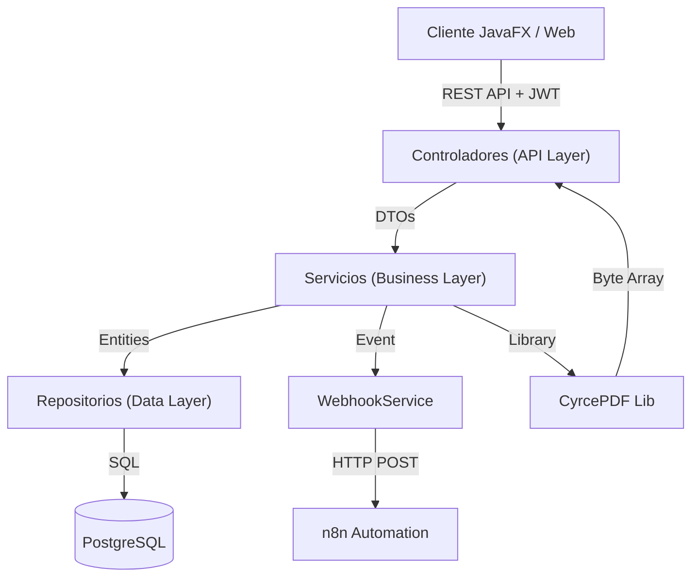
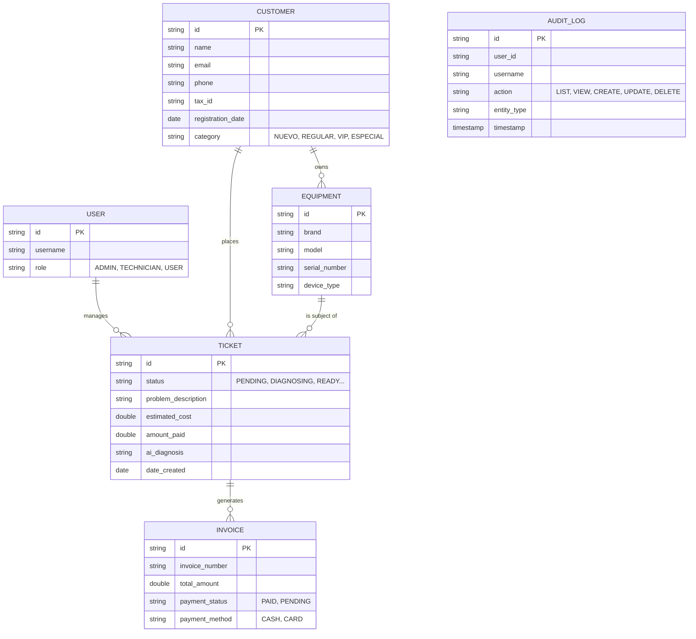
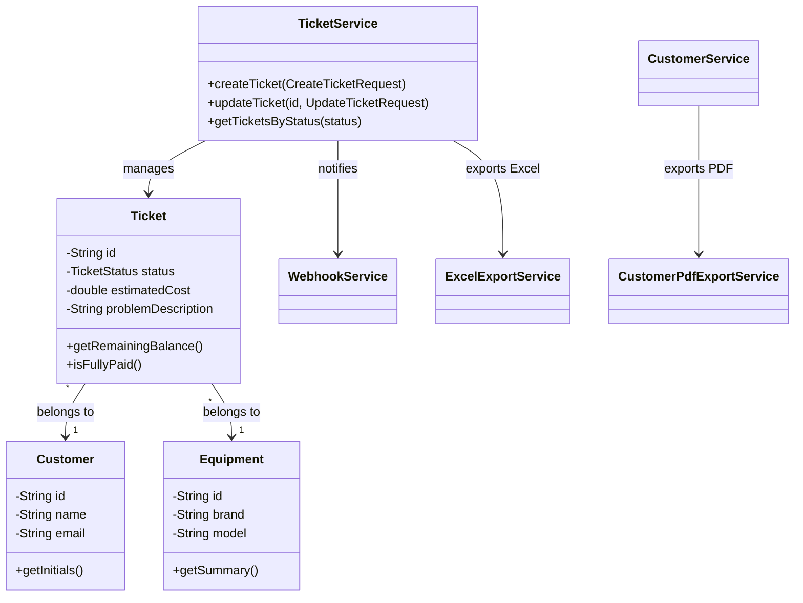
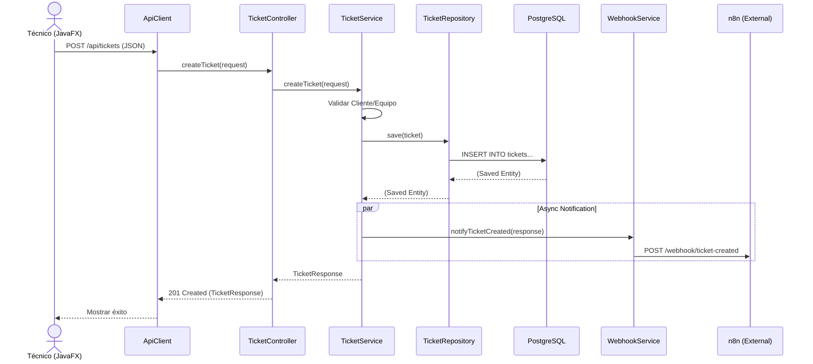

# Manual del Proyecto Cyrcetech v2.3.0

## 1. Introducción
Cyrcetech es un sistema integral de **Gestión de Taller de Reparación (SaaS / On-Premise)** diseñado para administrar ordenes de servicio, clientes, inventario y facturación. El sistema utiliza una arquitectura híbrida con un Backend centralizado (Spring Boot) y clientes Frontend (JavaFX Desktop y React Web).

### Tecnologías Clave
- **Backend**: Java 25, Spring Boot 3.4.0, Spring Security (JWT).
- **Frontend Desktop**: JavaFX 21, Modular, Estilos CSS modernos.
- **Frontend Web**: React (Vite).
- **Base de Datos**: PostgreSQL 18.
- **Integraciones**: CyrcePDF (Generación de Reportes), Apache POI (Excel), n8n (Automatización), Docker.

---

## 2. Arquitectura del Sistema
El sistema sigue una **Clean Architecture** (Arquitectura Limpia) adaptada, separando capas de responsabilidad.



---

## 3. Modelo de Datos (ERD)
Diagrama de Entidad-Relación que representa la estructura de la base de datos.



---

## 4. Diagrama de Clases (Dominio Principal)
Vista simplificada de las clases principales del Backend.



---

## 5. Diagrama de Secuencia (Creación de Ticket)
Flujo de interacción cuando un técnico crea una nueva orden de servicio.



---

## 6. Guía de Instalación y Uso

### Requisitos Previos
- Docker Desktop instalado.
- Java JDK 25 (para desarrollo).

### Pasos para Ejecutar
1. **Despliegue con Docker**:
   Ejecuta el siguiente comando en la raíz del proyecto para iniciar Base de Datos y n8n:
   ```bash
   docker-compose up -d
   ```

2. **Iniciar Backend**:
   Desde la carpeta `/backend` o raíz:
   ```bash
   ./gradlew :backend:bootRun
   ```

3. **Iniciar Cliente Desktop (JavaFX)**:
   Desde la raíz:
   ```bash
   ./gradlew :run
   ```

### Credenciales por Defecto (Base de Datos)
- **Login**: `postgres`
- **Password**: `password`
- **Host**: `localhost:5432 / db`

### Integración n8n
- Acceder a: `http://localhost:5678`
- Configurar el Workflow para escuchar `POST /webhook/ticket-created`.

---

## 7. Nuevas Funcionalidades v2.3.0

### Categoría de Clientes
| Categoría | Rango | Descripción |
|---|---|---|
| NUEVO | 0-30 días | Cliente reciente |
| REGULAR | 1-6 meses | Cliente establecido |
| VIP | 6-12 meses | Cliente fiel |
| ESPECIAL | 1+ año | Cliente preferencial |

### Sistema de Auditoría
- Registro automático de todas las acciones (LIST, VIEW, CREATE, UPDATE, DELETE)
- Filtros por usuario, rol, entidad y fecha
- Solo accesible por usuarios ADMIN

### Exportaciones
- **Excel (Tickets)**: `GET /api/tickets/export/excel`
- **PDF (Clientes)**: `GET /api/customers/export/pdf` (incluye antigüedad y categoría)

---
*Generado automáticamente por Antigravity AI - 2025*
